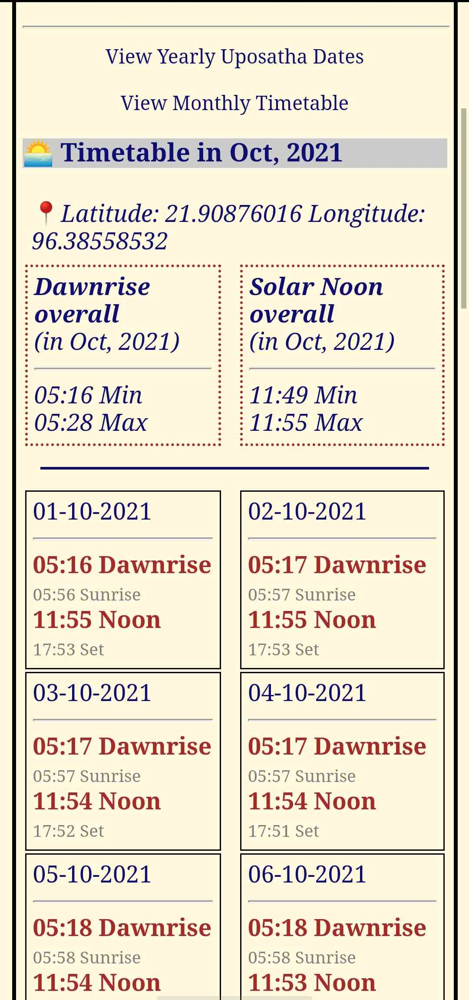

Upcal - Uposatha calendar and dawn time
----------------------------------------------

## 1. Info

Upcal has has three variants: HTML, Andrpid app, and iOS widget (via Scriptable app).

1. 🌅 [upCal HTML](https://vpnry.github.io/upcal/upcal_demo.html)

2. 🌅 **upCal Android app** Download APK from [upCal Android releases](https://github.com/vpnry/upcal-android/releases)

3. 🌅 iOS widget [read instructions](https://vpnry.github.io/upcal/#1-install-scriptable)

### Functions

+ Designed for Buddhists or ones who care about dawn-rise, noon time and Uposatha dates (Myanmar Uposatha dates).

+ It shows calculated **Myanmar uposatha dates** for the current device month & dawn-rise timetable for the current date and location.

+ List a whole year Uposatha dates of any year.

+ Dawn-rise time table for a whole month (Android and HTML only, iOS widget not yet).

### iOS widget

+ Whole year Uposatha dates:

### Android and HTML 

Main screen on Android:

Dawn-rise time table for a whole month:

## 2. Dev
+ Reduce screenshot file size: `jpegoptim --size=150k ./*.jpg`

+ Upcal-Android [source code](https://vpnry.github.io/upcal-android)

+ Source code files for iOS widget (run on Scriptable) are in the [docs](https://github.com/vpnry/upcal/tree/main/docs).

+ TODO: re-organise the very very messy Javascript code and add dawn-rise timetable for iOS widget.

## 3. Open Source Libraries Acknowledgements 

+ Myanmar uposatha dates: powered by the algorithm of Modern Myanmar Calendrical Calculations - [MMCal](https://github.com/yan9a/mmcal) (Yan Naing Aye)  (MIT License)

+ Dawn time, sunrise calculations:  powered by [SunCalc](https://github.com/mourner/suncalc) (Vladimir Agafonkin) (MIT License)

+ Scriptable Widget and table UI is based on this [Coronavirus Scriptable Widget](https://gist.github.com/planecore/e7b4c1e5db2dd28b1a023860e831355e) (03 Oct 2020)
  

## 4. Feedback

+ If you found bugs or errors related to this project, you may open a [new Git issue](https://github.com/vpnry/upcal/issues/new/choose) or contact us via this [Google Form](https://docs.google.com/forms/d/e/1FAIpQLSe9zXQVbkIynNwZAYlpc-C5QVCfYJ08pclcy8kuDtTgVk40YQ/viewform?usp=sf_link).

+ May you all be well and happy! 
