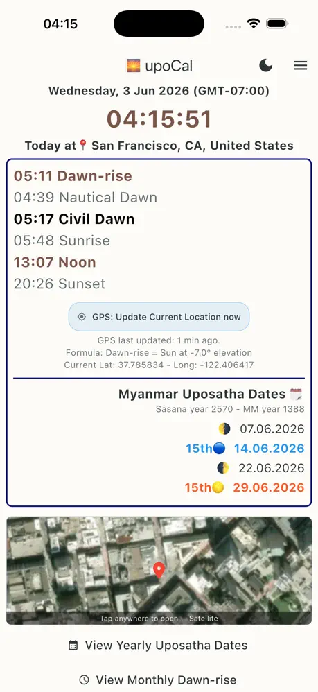
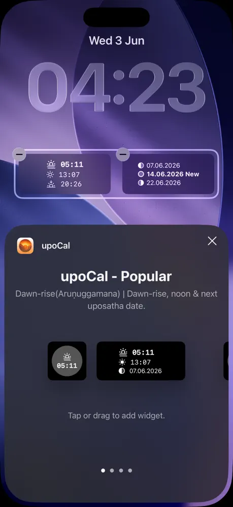
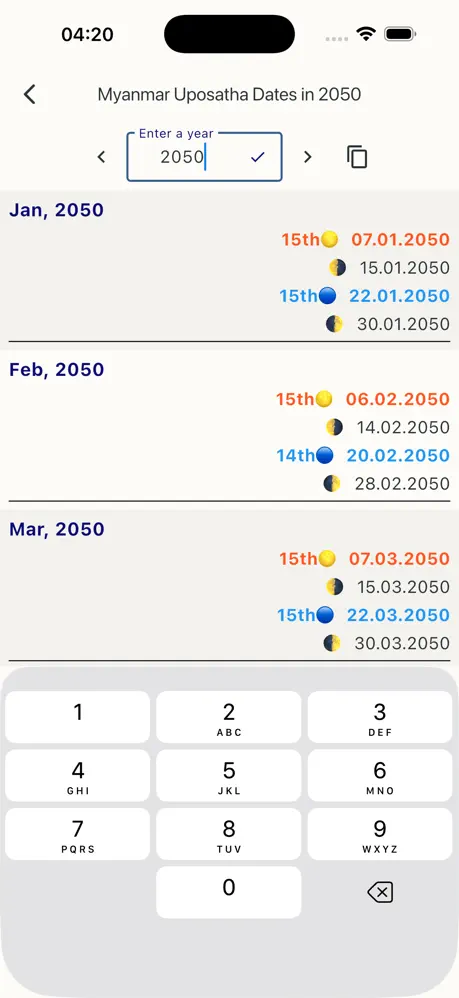
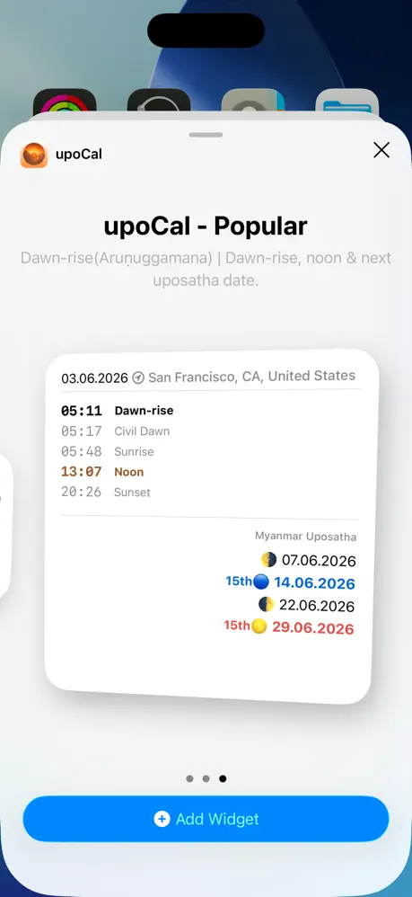
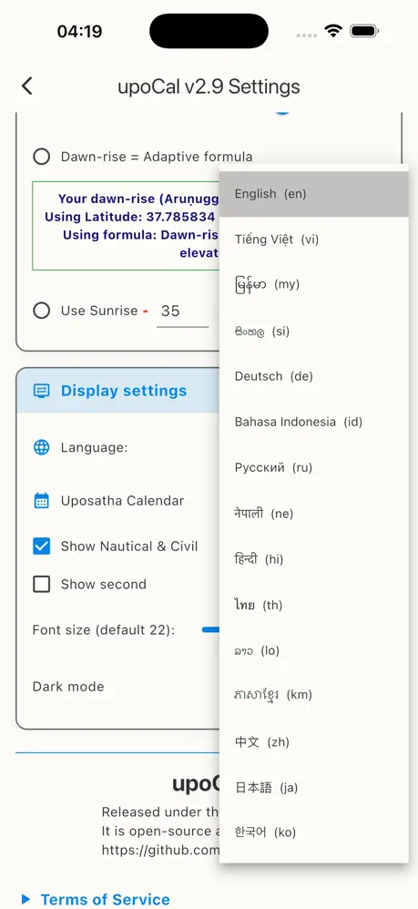
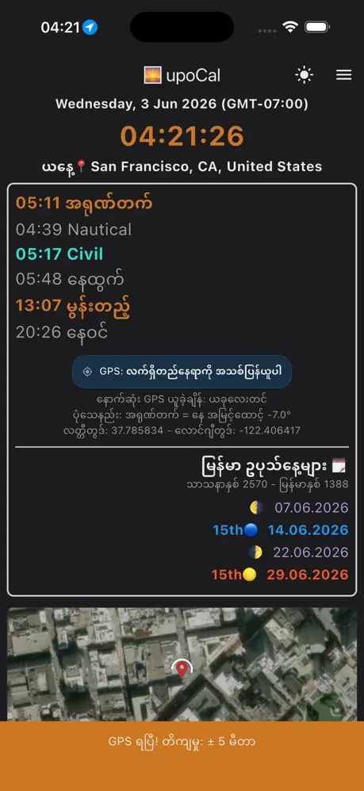

# upoCal – Myanmar Uposatha Calendar & Dawn-rise

**upoCal** is a free and open-source app for calculating highly accurate solar times and viewing Uposatha dates.

All calculations are performed directly on your device.

## Screenshots

### Accurate Solar Time Calculations

Optional down-to-the-second precision for:

• Solar noon

• Sunrise and sunset

• Civil dawn and dusk

• Nautical dawn and dusk

### Dawn-rise (Aruṇuggamana)

• Multiple calculation formulas available

• Adjustable according to individual preferences and traditions

### Myanmar Uposatha Calendar

• View Myanmar Uposatha dates years into the future or past
• Monthly timetable view
• Yearly calendar view

### Features

• Home Screen widgets and lock screen widgets in various sizes

• Battery-efficient widget updates

• Adjustable dawn-rise(Aruṇuggamana) calculation methods

• GPS-based dawn-rise, noon time calculations

• Support manual location input

• Satellite and street map location preview (Internet connection required)

• Dark Mode support

• Optional display of times down to the second

• Multilingual support

• No account required

• No advertisements

• Open source

Designed for practitioners, monastics, and anyone who wishes to follow solar times and Myanmar Uposatha observances with precision.
