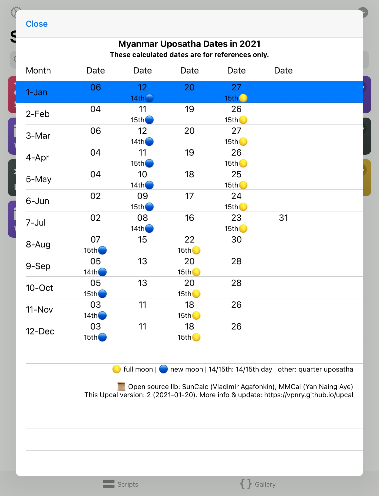

# Upcal - Myanmar Uposatha calendar and dawn time

## 1. Info

Upcal has has three variants: HTML, Android app, and iOS widget (via Scriptable app).

1. 🌅 [upCal HTML](https://vpnry.github.io/upcal/upcal_offline.html)

2. 🌅 **upCal Android app** Download APK from [upCal Android releases](https://github.com/vpnry/upcal-android/releases)

3. 🌅 iOS widget [read instructions](https://vpnry.github.io/upcal/#1-install-scriptable)

### Functions

+ Designed for Buddhists or ones who care about dawn-rise, noon time and Uposatha dates (Myanmar Uposatha dates).

+ It shows calculated **Myanmar uposatha dates** for the current device month & dawn-rise timetable for the current date and location.

+ List a whole year Uposatha dates of any year.

+ Dawn-rise time table for a whole month (Android and HTML only, iOS widget not yet).

### iOS widget screenshots


+ Whole year Uposatha dates:



### Android and HTML screenshots

Main screen on Android:


Dawn-rise time table for a whole month:


----

## 2. iOS/iPadOS Widget Instructions (for iOS version >= 14 only)

## 1. Install Scriptable
 [**Scriptable**](https://apps.apple.com/vn/app/scriptable/id1405459188) app by **Simon Støvring** from **App Store**.

   *(Note: iOS/iPadOS widget is only available for iOS/iPadOS version >=14)*

3. **Select** and **Copy** the below code:


```javascript

const gitURL = "https://vpnry.github.io/upcal/Upcal_Module.js";
const widgetName = "Upcal_Widget.js";
const moduleName = "Upcal_Module.js";
const jsonParsePoint = "u@pc@l";

let fm = FileManager.local();
const is_iCloud = fm.isFileStoredIniCloud(module.filename);
fm = is_iCloud ? FileManager.iCloud() : fm;

let filename = fm.fileName(module.filename, true);
if (filename != widgetName) {
  let newPath = fm.joinPath(fm.documentsDirectory(), widgetName);
  let str = fm.readString(module.filename);
  fm.writeString(newPath, str.trim());
  fm.remove(module.filename);
}
let modulePath = fm.joinPath(fm.documentsDirectory(), moduleName);
if (!fm.fileExists(modulePath)) {
  console.log(moduleName + " is not exist. Trying to download it from git.")
  let str = "";
  try {
    let r = new Request(gitURL);
    str = await r.loadString();
  } catch (e) {
    console.log("Error when trying to download module file:\n" +
      gitURL + "\n" + e);
    return;
  }
  if (str.indexOf(jsonParsePoint) > 0) {
    fm.writeString(modulePath, str);
  } else {
    console.log("Incompatible "+ moduleName +" file. Check!");
    return;
  }
}
// Must await & invoke app.init(fm) first
let app = await importModule(modulePath);
await app.init(fm);
if (config.runsInWidget) {
  let widget = await app.createUpCalWidget();
  Script.setWidget(widget);
} else { console.log(app.settings);
  await app.selectTask(); }

Script.complete();


```


1. [Click this URLScheme](scriptable:///add) to open Scriptable app and **Paste** the above code. _**Pls do not**_ click on the Play ▶️ icon to run it yet.  (So that the script will be renamed properly in step 3 below).
2. Tap **Done** on the top left corner of Scriptable app to save it.
3. In Scriptable main screen, tap on the script file you have just created to run it (normally it will be automatically named with a prefix as Untitled Script ).
4. It will auto create a new file named **Upcal_Widget** and download **Upcal_Module** from this git server.
5. Follow its instructions to do location setup for dawn time calculation [or skip and do later].
6. Close Scriptable app, then add a Scriptable widget (and select the script file **Upcal_Widget**).

If you do not know how to add a Scriptable widget to your device home screen, try reading [4. How to add a widget to home screen on iOS/iPadOS (ver >=14)](#4-how-to-add-a-widget-to-home-screen-on-iosipados-ver-14) or do a search on the Internet.

## 2. Quick intro to Scriptable app

If you haven't used Scriptable app before, here is a quick guide:

> + To **create** a new file: Open Scriptable app, tap on the Plus ➕ icon (on the top right corner)

> + To **edit** an exist script file: tap on the three dot (on the top right) of the file.

> + To **run** a script file: in Scriptable app main screen, tap on the middle of the file, or on script file icon. Or tap on the **Play** ▶️ icon (on the bottom right corner) if you are editing it.

> + To **delete** a script file: tap & hold, select **Delete** in the pop up menu.

## 3. Update Latitude and Longitude
Dawn time calculation function needs location data. You can use GPS to automatically update location data or fill in manually:

### Fill in location manually

+ You can fill in location latitude and longitude data manually. In Scriptable app main screen, open the script file **Upcal_Setting** and update the default values.

### Use GPS to automatically fill in location data

+ **<u>If you have no concerns about location privacy,</u>** this option is a convenient choice.

+ In Scriptable app main screen, run **Upcal_Widget**, it will show a few menus which include “📡 **Use GPS Update Location**”. Use this to update your location.

**Notes**:

+ Remember to turn on  Location service (GPS) in your device *Setting > Privacy*, and give location access to Scriptable app before running this update location function. You can just allow Scriptable app to access location service for one time;

+ After Scriptable app successfully updated your location, you can revoke Scriptable app location access permission and turn off your Location service completely to save battery.

+ Upcal should work completely offline and no need GPS turned on.

If you get errors related to location, see [**Troubleshooting**](#5-troubleshooting) session below. 


If it detects your location successfully! Congrats!

## 4. How to add a widget to home screen on iOS/iPadOS (ver >=14)

For this thing, you can search more on the Internet. One way to do is, from an iPad/iPhone home screen:

+ Swipe from left to right until you arrive the widget page (= you can not swipe any more).
+ Tap and hold on an empty place until the icons/screen are shaking.
+ Click on the plus ➕ icon (on the top left corner) to add new widget.
+ On the search field area, type Scriptable to search, and tap on it in the search results.
+ Swipe from right to left or left to right to find & choose the **biggest** widget size on your device. Tap Add widget.
+ A new Scripable widget will appear on the home screen. Again top on it to configure it with these choices:

```text

Script field: select **Upcal_Widget**
When Interacting: choose **Run Script**

```
The option When Interacting: **Run Script** will allow you to click on the widget to run Upcal in app directly.

##  5. Troubleshooting

### 5.1 Scriptable cannot detect your location

If the following error occurs when Scriptable app is trying to get location data, something like:

```bash
 'kCLErrorDomain error 0.' occurs:
```

**To fix this error and other possible errors related to fetching GPS data, you may try:**

> + Close Scriptable app first
> + Make sure you have turned on location service in your device *Setting > Privacy* and allow location access for both Maps app (by Apple - or other your-trusted map apps) and Scriptable app.
> + Opening the **Maps** app (by Apple) (or your other trusted map apps) and ask Maps to detect your location, wait until Maps successfully locate 📍 your location (blue circle dot).
> + Then quickly open Scriptable app, in its main screen, run `Upcal_Widget` and choose “📡 **Use GPS Update Location**” to detect location again.

These issues may likely happen if you did not use or turn on Location service on your iPhone/iPad for a long time.

### 5.2 I have updated my location why the widget is still showing the same values?

You may try these tips:

+ Make sure you have saved your updates or let the update process finish.
+ To force the widget to reload the script, simply tap on it (to run it, if you have selected the option `When Interacting`: as **Run Script** as instructed above).
+ Swipe screen from left to right or right to left to refresh the Widget?
+ Do nothing, and also do not trying to "do nothing". For get about this, come back later after ... hours, the decvice should do refreshing itself.

### 5.3 The formulas for dawn time calculation

+ Currently, Upcal has 2 formulas for dawn time calculation. 

+ Formula 2 `Dawn = Sunrise - (Civil dawn - Nautical dawn)` is enabled by default.

+ To use Formula 1: `Dawn time = Sunrise time - u_DawnMinus (u_DawnMinus is a fixed minute)`.  In Scriptable app main screen, open the script file **Upcal_Setting** and change the value of `”useDynamicDawn_Formula2”` to `false`.

+ Note: `u_DawnMinus` = 40 is an observed minute number in our place, it may not be correct for all places. You can change this value or simply use the Formula 2 instead.

+ Keep in mind that both of the formulas are not 100% perfect. The dawn time (aruṇuggamana) is not a fixed figure for all places. [A research book on this](#6-related-reading).

### 5.4 Show|hide Nautical & Civil dawn info on the widget

+  By default Upcal hides the Nautical & Civil dawn values which helps the widget concise.
+  To show or hide them, in Scriptable app main screen, open the script file **Upcal_Setting** and change the value of `”displayNauticalCivilDawn”` to `true`. Or to `false` to hide them.

## 6. Related reading
There is an interesting research book Dawn (aruṇa) and Dawnrise (aruṇuggamana) in the Pāḷi Text:

```text

When Is Dawn (aruṇa)? When Is Dawnrise (aruṇuggamana)?
Research on Dawn (aruṇa) and Dawnrise (aruṇuggamana) in the Pāḷi Text  with Photographs and Scientific Explanations 
by Bhikkhu Ñāṇadassana

```


## 8. Notes:

+ When you move to a new city/new place, remember to update the lat & longitude values (manually or automatically). Otherwise, the dawn time calculation will just  show its calculated values from the previous place.

+ The author(s) and contributor(s) of this project take no responsibilities or warranties for any issues related to the use of this app, include, but not limited to, your location privacy or the accuracy of calculated data...

+ Keep in mind that the calculated results are for references only, it may vary (especially the dawn time) and incorrect , use with wisdom and peaceful mind!

+ If you do not trust Scriptable app, or Apple Maps or this [open source Upcal](https://github.com/vpnry/upcal) simply don't use them.


## 9. Open Source Libraries Acknowledgements 

   + Myanmar uposatha dates: powered by the algorithm of Modern Myanmar Calendrical Calculations - [MMCal](https://github.com/yan9a/mmcal) (Yan Naing Aye)  (MIT License)
  + Dawn time, sunrise...:  powered by [SunCalc](https://github.com/mourner/suncalc) (Vladimir Agafonkin) (MIT License)

  + Scriptable Widget and table UI is based on this  [Coronavirus Scriptable Widget](https://gist.github.com/planecore/e7b4c1e5db2dd28b1a023860e831355e) (03 Oct 2020)

## 10. Feedback

+ If you have any suggestions or found bugs, may give feedback here on [Google Form](https://forms.gle/1FzEVDYajhNXSkad7).

+ May you all be well and happy! 


